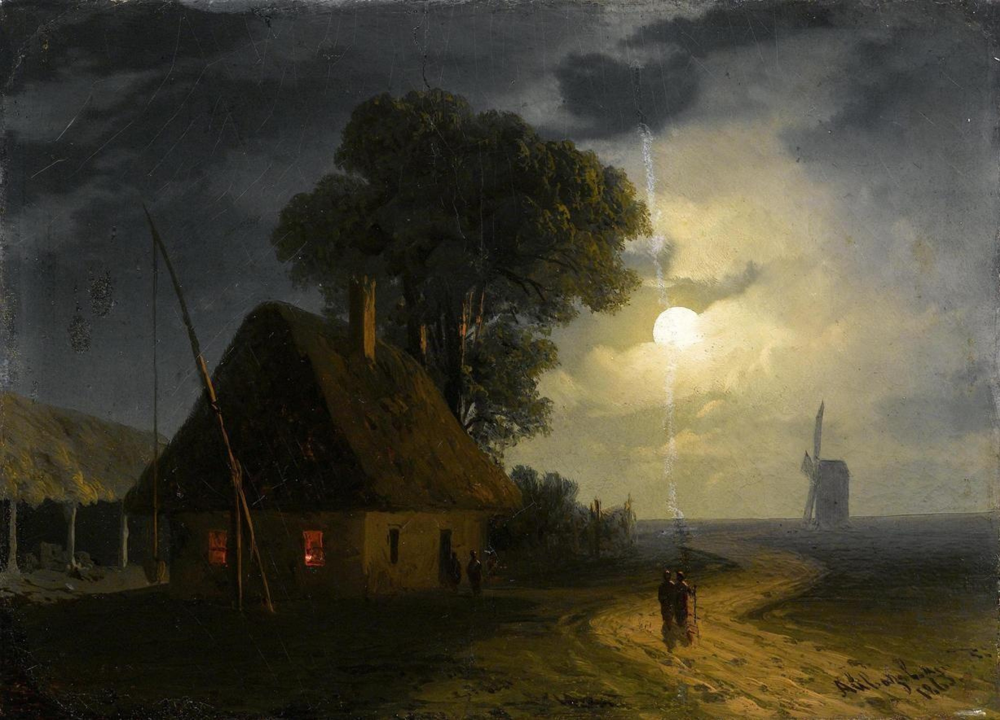

<!-- markdownlint-disable -->

# Hey 

I'm Varak.

  <!--  -->
  
  

  

## Statistics & Tech Stack 

<!-- Regular stats -->

<!-- GitHub Readme Streak Stats - https://github.com/DenverCoder1/github-readme-streak-stats -->

  

<!-- Stats, etc. table -->

<!-- <table style="border:none;">
  <tr>
    <td></td>
    <td></td>
    <td></td>
  </tr>
</table> -->

<!-- Snake animation -->
<!-- Dark by default, light otherwise -->

  

    <picture>
      <source media="(prefers-color-scheme: dark)" srcset="dist/github-snake-dark.svg" />
      <source media="(prefers-color-scheme: light)" srcset="dist/github-snake.svg" />
      
    </picture>
  

  
  
  
  
  
  
  
  
  
  
  
  
  
  
  
  
  
  
  
  
  
  

<!-- Just a border, don't bother customizing -->

  

